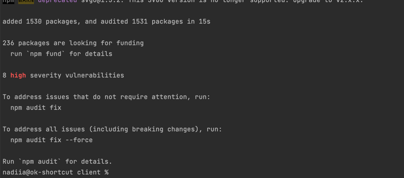
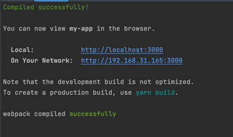

# Test_Full_Stack_Dev

# Getting Started App

## Start client

### open terminal 2

### `ls -la`

### result:

In the project directory 'Test_Full_Stack_Dev', you can run:

### `cd client`

### `npm install` or `npm i`

### `npm start`

Runs the app in the development mode.\
Open [http://localhost:3000](http://localhost:3000) to view it in your browser.

